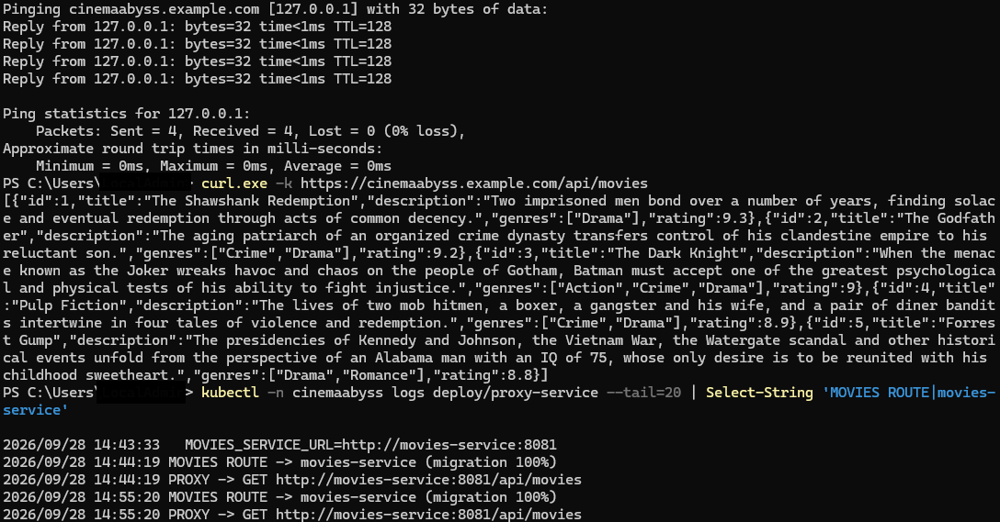
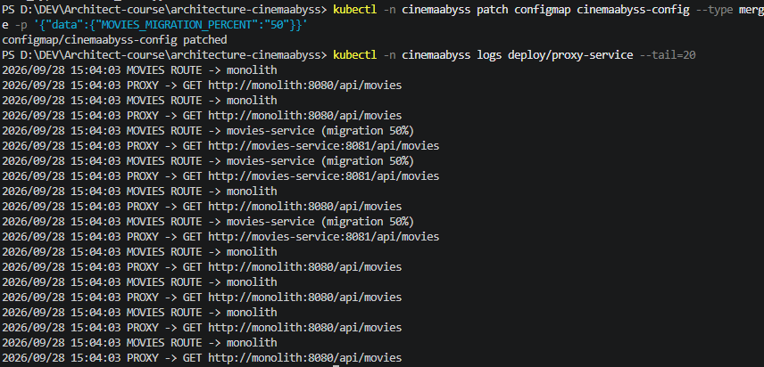
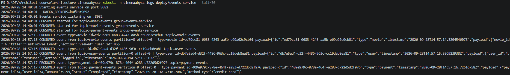
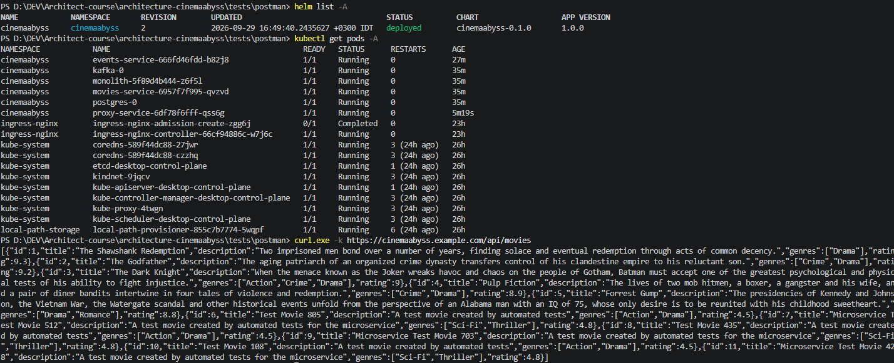

## Изучите [README.md](.\README-правка.md) файл и структуру проекта.

# Задание 1 — To-be архитектура (C4)

Контейнерная диаграмма to-be архитектуры с выделенными доменами и единой точкой входа:

- [c4_containers.puml](docs/architecture/to_be/c4_containers.puml) — целевая архитектура
- [c4_containers-MVP.puml](docs/architecture/as_is/c4_containers-MVP.puml) — текущее состояние (MVP)

# Задание 2 — Strangler Fig Proxy + Kafka MVP

### 1. Proxy / API Gateway

Go, stdlib only (`net/http`, `httputil`). Stateless reverse proxy / API Gateway.

**Маршрутизация:** `/health` → сам прокси; `/api/movies` + `/api/movies/` → монолит или movies-service (Strangler Fig); `/api/events/` → events-service; остальное → монолит.

**Strangler Fig.** `GRADUAL_MIGRATION` (вкл/выкл) + `MOVIES_MIGRATION_PERCENT` (0–100). Каждый запрос к `/api/movies*` с вероятностью, равной проценту, уходит в movies-service, остальные — в монолит. Переключение без простоя, только изменение env и restart.

**Проверка.** Postman `test:local` — все зелёные. `curl http://localhost:8000/api/movies` — список фильмов. Логи показывают распределение: `MOVIES ROUTE -> movies-service (migration 50%)` / `MOVIES ROUTE -> monolith`.

### 2. Events / Kafka MVP

Go, `segmentio/kafka-go`. Сервис одновременно producer и consumer: POST на API публикует событие в топик Kafka, фоновые consumer'ы читают и логируют.

**API:** `GET /api/events/health`; `POST /api/events/{movie|user|payment}` → 201 + событие в соответствующий топик (`movie-events`, `user-events`, `payment-events`).

**Проверка.** Логи: `PRODUCED event type=movie id=... topic=movie-events` → `CONSUMED event from topic=movie-events ...`. Postman `test:local` — раздел Events полностью зелёный.

# Задание 3 — CI/CD + Kubernetes

### CI/CD

GitHub Actions workflow (`.github/workflows/docker-build-push.yml`): триггеры `pull_request → main`, `push → main`, `release published`. Собирает все 4 образа (monolith, movies, events, proxy) и пушит в GHCR. Второй job (`api-tests`) поднимает docker-compose стек и прогоняет Newman-тесты — merge gate.

### Proxy в Kubernetes

**Кластер.** Встроенный Kubernetes Docker Desktop (контекст `docker-desktop`, K8s v1.36).

**Деплой.** Манифесты в `src/kubernetes/`, namespace `cinemaabyss`: namespace → configmap/secret/dockerconfigsecret → postgres (StatefulSet) → kafka → monolith → movies-service → events-service → proxy-service → ingress.

**Kafka: KRaft.** Переведён с Zookeeper на KRaft-режим (`apache/kafka:3.7.0`, роли `broker,controller`). Service открывает оба порта: 9092 (broker) и 9093 (controller). Без 9093 брокер не регистрируется в кворуме.

**GHCR.** Приватные образы `ghcr.io/bormoley1983/architecture-cinemaabyss/*:latest`, секрет `kubernetes.io/dockerconfigjson`.

**Ingress.** nginx ingress controller v1.12.1 (namespace `ingress-nginx`). Маршруты: `/api/events` → events-service:8082; `/` → proxy-service:8000. Хост: `cinemaabyss.example.com`. Внешний доступ через port-forward на ingress-контроллер.

**Strangler Fig в K8s.** `MOVIES_MIGRATION_PERCENT` в ConfigMap. После изменения — `rollout restart` прокси. При 50% запросы распределяются поровну, при 100% — все в movies-service.

**Тесты.** `npm run test:kubernetes` — 22 запроса, все HTTP-запросы успешны. Создание событий отработало полностью (produce → consume для всех трёх типов).

Вывод `https://cinemaabyss.example.com/api/movies`:



Логи event-service — обработка событий в Kafka:



Состояние топиков Kafka:



# Задание 4 — Helm Charts

Helm-чарт в `src/kubernetes/helm/` для полного стека (postgres, kafka, monolith, movies, events, proxy, ingress).

**values.yaml.** Пути до образов GHCR, imagePullSecret (base64 dockerconfigjson), ресурсы, порты, Kafka KRaft-конфигурация.

**Шаблоны.** `templates/services/proxy-service.yaml` — Deployment + Service с env из ConfigMap, readiness/liveness probes на `/health`, imagePullSecrets. `templates/services/events-service.yaml` — аналогично + init container `wait-for-kafka` (цикл `kafka-consumer-groups.sh --list` до готовности брокера). `templates/kafka/kafka.yaml` — StatefulSet KRaft (apache/kafka:3.7.0) + Service (9092, 9093) + PVC.

**Установка.**
```bash
helm install cinemaabyss ./src/kubernetes/helm --namespace cinemaabyss --create-namespace
```

**Проверка.** Все 6 подов Running. `https://cinemaabyss.example.com/api/movies` — список фильмов (полный путь ingress → proxy → movies-service). Postman `test:kubernetes` — 22/22 запроса, 42 ассерции, 0 падений.


